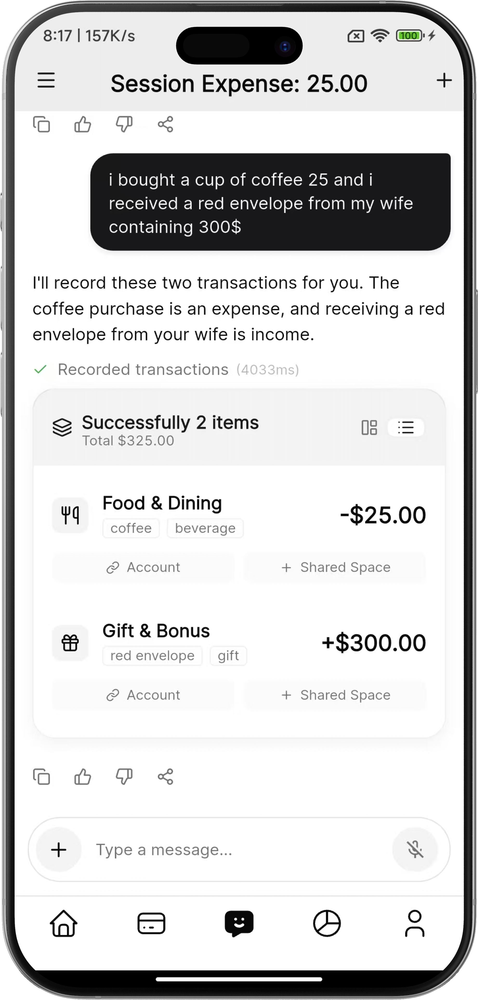
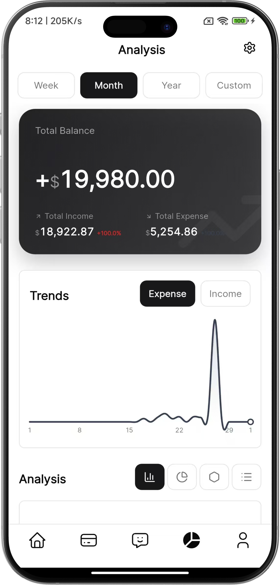
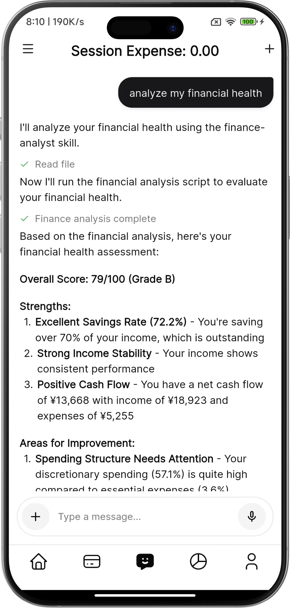
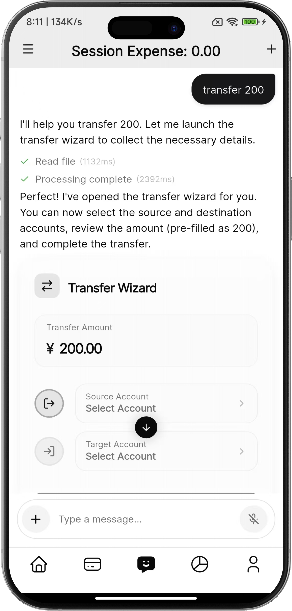

<p align="center">
  
</p>

<h1 align="center">Augo</h1>

<p align="center">
  <ins><b>Self-Hosted & Privacy-First AI Financial Assistant</b></ins>
</p>

<p align="center">
  <a href="https://github.com/kylesean/augo/blob/main/LICENSE"></a>
  <a href="https://www.python.org/downloads/release/python-3130/"></a>
  <a href="https://flutter.dev"></a>
  <a href="https://github.com/kylesean/augo/pulls"></a>
</p>

<p align="center">
  <a href="./README.md">English</a> | <a href="./README.zh-CN.md">简体中文</a>
</p>

<p align="center">
  
  
  
  
</p>

---

**Augo** is a premium, open-source AI financial assistant designed for individuals and families who prioritize **data sovereignty** and **absolute privacy**. Unlike centralized financial apps, Augo is built to be **self-hosted**, giving you 100% ownership of your financial records and personal intelligence.

---

## 🛡️ Privacy & Sovereignty First

- **Data Sovereignty**: Deploy on your own hardware or private cloud. Your financial history never leaves your infrastructure.
- **Privacy by Design**: No third-party data mining. You control the encryption keys and access.
- **Family Oriented**: Securely manage individual accounts or coordinate household finances in a private, shared environment.
- **Transparent AI**: Run orchestration locally. Leverage the power of AI without compromising your financial secrets.

## 🌟 Key Features

- **Natural Interaction**: Record transactions via voice or text with a human-like assistant that understands context.
- **Privatized Intelligence**: Deep analysis of spending patterns and budget health, computed on your own terms.
- **Generative UI (GenUI)**: Powered by the **Google A2UI protocol**, the interface adapts and evolves based on your queries in real-time.
- **Global Ready**: Built-in multi-currency support with private exchange rate management.
- **Smart Orchestration**: Leverages **LangGraph** for complex financial reasoning and high-precision tool usage.

## 🚀 Core Technology

Augo is built on a cutting-edge technological foundation:

- **Back-end**: **Python 3.13 (FastAPI)** managed with **uv** for high performance and reliability.
- **Front-end**: **Flutter** mobile application providing a premium, native experience using the **Forui** design system.
- **AI Engine**: **LangGraph** for agentic reasoning and **Mem0** for intelligent long-term memory.
- **Database**: **PostgreSQL** with **pgvector** for both structured financial data and vectorized knowledge.

---

## 🛠️ Quick Start

### Prerequisites

- **Docker & Docker Compose** (Recommended)
- **Python 3.13** (Local dev, [uv](https://github.com/astral-sh/uv) recommended)
- **Flutter SDK** (Client development)

---

### 🐳 Docker Deployment (Recommended)

The fastest way to get Augo up and running with database, Redis, and monitoring.

1. **Clone the repository**:
   ```bash
   git clone https://github.com/kylesean/augo.git
   cd augo
   ```
2. **Setup environment**:
   ```bash
   cp server/.env.example server/.env
   # Edit server/.env with your API keys (OpenAI, DeepSeek, etc.)
   ```
3. **Start the stack**:
   ```bash
   make docker-up
   ```
   *Once started, the terminal will display a QR code for easy mobile app connection.*

---

### 💻 Local Development

1. **Initial Setup (Everything)**:
   ```bash
   make setup-all
   ```
   *Installs Python and Flutter dependencies and initializes the database.*

2. **Start Backend**:
   ```bash
   make start
   ```

3. **Run Client**:
   ```bash
   make client-run
   ```

---

## 📝 Essential Commands (Makefile)

| Command | Description |
| :--- | :--- |
| `make setup-all` | Full environment setup and DB initialization |
| `make start` | Start the local FastAPI server |
| `make docker-up` | Build and launch all Docker services |
| `make docker-down` | Stop and remove Docker containers |
| `make lint` / `make format` | Check and fix Python code quality |
| `make test` | Run backend test suite |
| `make client-run` | Launch Flutter app on connected device |
| `make gen-keys` | Generate secure JWT and Encryption keys |

---

## 🗺️ Project Structure

- `/client`: Premium Flutter app using Forui.
- `/server`: High-performance FastAPI backend with LangGraph agents.
- `/docker-compose.yml`: Full stack orchestration (API, DB, Redis, Monitoring).
- `/docs`: Detailed documentation:
  - [Architecture Overview](docs/ARCHITECTURE.md)
  - [Private Self-Hosting Guide](docs/SELF_HOSTING.md)

## 📄 License

This project is licensed under the AGPLv3 License - see the [LICENSE](LICENSE) file for details.

## 🤝 Contributing

We welcome contributions! Please see our [Contributing Guide](CONTRIBUTING.md) for details.

---

Email: jkxsai@gmail.com.
